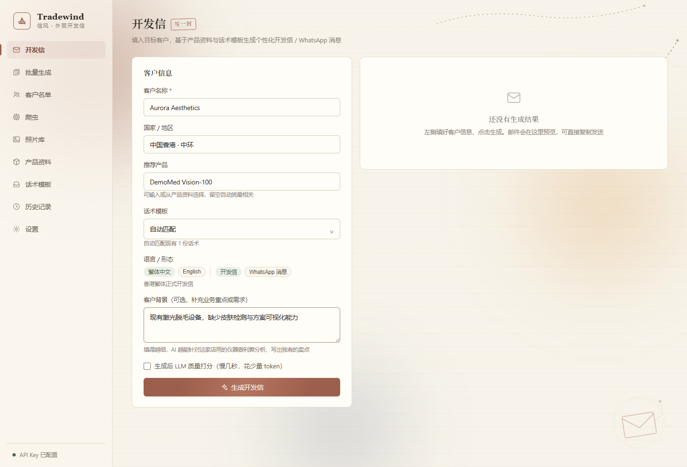
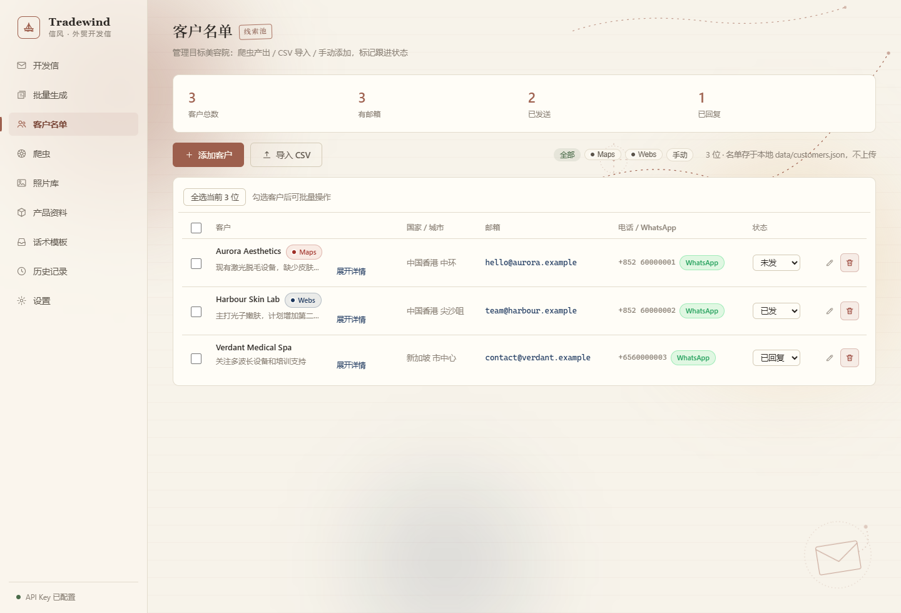
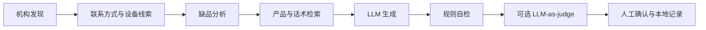

# Tradewind · 信风

[](https://www.python.org/)
[](https://fastapi.tiangolo.com/)
[](https://react.dev/)
[](https://v2.tauri.app/)
[](https://github.com/inervers/Tradewind/actions/workflows/secrets-scan.yml)

一个本地优先的外贸获客与开发信 Agent：从机构发现、联系方式提取和设备线索识别，
一路完成缺品分析、个性化写信、规则自检与可选质量评估。耗时操作统一为可取消、
可追踪的后台任务，并提供浏览器绿色版与 Tauri 桌面端两种交付形态。

> 本仓库用于作品展示和工程交流。仓库内品牌、联系人、号码、邮箱、客户与邮件内容均为
> 合成或匿名化示例；请勿把真实客户资料、API Key、照片或运行日志提交到 Git。

<p align="center">
  
  
</p>

## 30 秒看懂项目

| 问题 | Tradewind 的回答 |
|---|---|
| 输入是什么 | 目标地区与机构关键词、产品资料、话术模板，以及人工确认后的客户背景 |
| Agent 做什么 | 发现机构 → 抽取联系方式与设备线索 → 分析品类缺口 → 检索产品/话术 → 生成开发信 → 规则自检 → 可选 LLM-as-judge |
| 输出是什么 | 可人工审核、复制或下载的邮件 / WhatsApp 文案，以及保存在本机的客户与评估记录 |
| 工程重点 | 任务生命周期、流式输出与取消、多模型路由、爬虫降级、桌面分发、运行数据隔离 |
| 明确不做什么 | 不自动群发、不把模型输出当事实、不上传客户资料、不为了小规模本地数据强接向量库 |

## 可验证的工程证据

| 维度 | 仓库内证据 |
|---|---|
| Agent 链路 | `app/email_agent.py`：本地检索、生成、规则检查、可选 Judge、SQLite 记录 |
| 任务可靠性 | `server.py` + `frontend/src/tasks.ts`：统一 task id、轮询恢复、流式状态与取消 |
| 数据采集 | `app/crawler/`：Maps / Webs 机构发现、联系方式提取、照片设备识别与缺品分析 |
| 多端交付 | FastAPI 静态托管、浏览器绿色版、Tauri 2 + Python sidecar，三种运行形态共用后端 |
| 质量保障 | 74 项后端自动化测试、`eval/fixtures/` 合成评测夹具、TypeScript 检查与 Web / Tauri 两套 Vite 构建 |
| 发布安全 | 本地数据目录隔离、`detect-secrets` pre-commit、GitHub Actions TruffleHog 完整历史扫描 |

## Agent 工作流



## 核心功能

| 模块 | 能力 |
|---|---|
| **爬虫**（`app/crawler/`） | Google Maps 搜美容院（medspa/beauty clinic…）→ 滚动批量收集 → 详情页挖邮箱/电话/WhatsApp → 照片视觉识别仪器品牌 → **缺品分析**（"缺什么推什么"）→ 客户名单 CSV |
| **写信**（`app/email_agent.py`） | 本地产品库检索 → 按所选话术模板生成 → 规则自检（零 token）→ 可选 LLM-as-judge 四维打分 → SQLite history/evaluation log。单封/批量、邮件/WhatsApp、流式输出与后台取消 |
| **话术模板** | 历史邮件（脱敏）或文档原文导入；生成时显式选择，正文完整参与提示词，不再由导入模型改写 |
| **照片库** | 按店铺管理爬虫照片，重命名/删除店铺，手动导入多张图片，选择图片重新识别并查看实际 provider/model |
| **文档识别导入** | PDF/图片 → OCR（RapidOCR）→ 产品资料结构化入库；话术资料保留解析/OCR 原文，任务制支持取消 |
| **前端 / 桌面端** | React + Vite 九个工作区；Tauri 2 桌面壳负责单实例、启动动画、后端 sidecar 生命周期和窗口恢复 |

## 工程设计与技术取舍

| 设计决策 | 原因与边界 |
|---|---|
| 小规模资料使用本地 JSON + 关键词加权检索 | 产品和话术只有几十条，标题、标签和正文可解释打分比远程向量库更容易分发、调试和隔离；数据规模扩大后再评估 Embedding |
| 确定性规则先于 LLM Judge | 长度、签名、禁用表达等问题先用零 token 规则稳定发现；Judge 只负责相关性、清晰度等语义维度，降低成本并保留可复现性 |
| 主语言模型与视觉模型分开路由 | 写信与照片识别的能力、价格和网络条件不同；各 Provider 独立保存配置，单一服务商故障不会让整个采集链路失效 |
| 耗时操作统一任务制 | 邮件、爬虫和 OCR 都返回 task id，由前端轮询状态；切换工作区后仍可恢复，取消时不写入不完整结果 |
| 采集链路分层降级 | 没有视觉 Key 时仍保留本地文本识别、联系方式提取和缺品推荐；第三方模型不可用不阻断基础流程 |
| 本地优先而非多租户 SaaS | 客户、邮件、照片和 Key 留在用户数据目录，升级程序不覆盖；代价是当前不提供账号、协作和云同步 |

补充实现：Webs 发现优先机构官网结果，不足时合并 Google / Bing；新闻、百科、
目录站和行业无关页面在入库前过滤。签名由系统统一追加，避免模型重复生成或遗漏
联系人信息。更完整的取舍与事故复盘见 [OPS-NOTES.md](OPS-NOTES.md)。

## 建议代码阅读路径

1. `server.py`：FastAPI 任务接口、运行数据边界和静态资源托管。
2. `app/email_agent.py`：检索、生成、自检、Judge 与记忆记录的主链路。
3. `app/crawler/`：机构发现、联系方式抽取、视觉识别与缺品分析。
4. `frontend/src/tasks.ts` 与各工作区：任务恢复、取消和结果呈现。

## 工程边界

- 项目定位是本地单用户工具，不是多租户 SaaS；没有账号、权限和远程数据库。
- LLM 输出、联系方式和缺品建议都需要人工确认，不能直接视为事实或自动发送。
- Google Maps、搜索引擎和第三方模型接口可能因地区、网络、限流或页面结构变化而失效。
- 当前不包含 SMTP 自动发信，避免在缺少审核、退订和频控机制时形成群发风险。
- 仓库未附开源许可证，代码目前仅供查看和评估；如需复用，请先联系仓库维护者。

## 数据与密钥安全

- `.env` 与 `data/config.json` 只保存在本机；`.env.example` 仅列出变量名和占位值。
- 客户名单、SQLite、爬虫照片、诊断日志、OCR 中间文件、输出目录和构建产物均由 `.gitignore` 排除。
- `data/products.json`、`data/emails.json` 与 `packaging/default-data/` 只包含演示数据。使用界面导入业务资料后，不要提交这些文件的运行时变化。
- 提交前由 `detect-secrets` 扫描，GitHub Actions 再用 TruffleHog 检查 push、PR 和完整历史。

## 快速开始

```powershell
pip install -r requirements.txt

# 源码版如需爬虫和文档 OCR
pip install -r requirements-optional.txt
playwright install chromium

# 启动后端（端口 8101）
python run.py

# 构建前端（包含 TypeScript 检查）
cd frontend
npm ci
npm run build:check
```

浏览器打开 `http://127.0.0.1:8101`。首次使用在设置页配服务商 key（写信）和视觉 key（爬虫照片识别）。

### 浏览器绿色版

```powershell
# 构建前端并生成免安装目录
powershell -ExecutionPolicy Bypass -File scripts/build-portable.ps1
```

构建结果包括 `dist/Tradewind-Portable/` 免安装目录、带日期版本号的 ZIP 和对应
SHA256 校验文件。用户完整解压 ZIP 后双击 `Tradewind.exe`，程序会等待
`/api/health` 就绪后打开默认浏览器。重复双击只会重新打开页面，不会再启动后端。

```powershell
# 发布前用临时数据目录启动 EXE，并实测健康接口与文件导入
powershell -ExecutionPolicy Bypass -File scripts/test-portable.ps1
```

- 默认数据目录：`%LOCALAPPDATA%\Tradewind\data`，升级程序目录不会覆盖用户数据。
- 将随包的 `portable.flag.example` 重命名为 `portable.flag` 后，数据改存程序目录，适合 U 盘携带。
- 打包只带 `packaging/default-data/` 中的干净初始模板，不包含源码目录下的 Key、客户、照片和运行记录。
- 爬虫复用用户电脑上的 Microsoft Edge 或 Google Chrome，不额外捆绑浏览器。
- 浏览器绿色版与 Tauri 桌面端是两条独立构建链，执行本脚本不会重建桌面 sidecar。
- 设置页可由用户主动导出脱敏诊断包；软件不做后台遥测，不上传 Key、客户内容、邮件、照片或原始日志。

### Tauri 桌面开发

```powershell
cd frontend

# 源码开发：Vite + Tauri；桌面壳会从项目环境启动 Python 后端
npm run desktop:dev

# 只构建桌面前端并检查类型
npm run build:desktop

# 完整发行构建（会先重建体积较大的 Python sidecar）
npm run desktop:build:full
```

当前桌面阶段采用 Tauri 2 + PyInstaller sidecar。应用会等待
`http://127.0.0.1:8101/api/health` 后恢复配置；重复打开会唤醒已有窗口。
桌面运行数据写入 `%LOCALAPPDATA%\com.tradewind.desktop\data`，源码版仍使用项目内 `data/`，两者互不覆盖。

### 命令行直跑

```powershell
# 爬虫（需代理 Verge 7897，Google Maps 国内不可达；香港市场）
python -m app.crawler.maps_hunter --queries "medspa" --country 香港 --max 5 -v

# 官网深挖（邮箱/电话/WhatsApp/社媒/仪器）
python -m app.crawler.webs_hunter --queries "medical aesthetic clinic Hong Kong laser treatment" --max 5 -v

# 单封开发信
python -m app.email_agent "Glow Skin Clinic" --country 香港 --product 激光脱毛仪 --judge -v
```

## 测试与发布前检查

```powershell
# 后端单元测试
python -m unittest discover -s tests -v

# 离线生成质量评测，不消耗 token
python eval/generate_quality_report.py

# 前端类型检查与构建
cd frontend
npm ci
npm run build:check

# 首次安装提交前安全钩子
cd ..
python -m pip install pre-commit detect-secrets
pre-commit install
pre-commit run detect-secrets --all-files
```

评测夹具位于 `eval/fixtures/`，只使用合成数据。便携版发布还应运行
`scripts/test-portable.ps1`，并在干净 Windows 环境中完成一次人工验收。

## 爬虫视觉识别（缺品分析）

流程：商家照片 → 视觉模型认仪器 → 对比产品库品类画像 → 输出"设备名（缺：品类）"。

- **多服务商**（设置页视觉卡切换）：智谱 GLM、火山豆包和 OpenAI；模型名允许手输，以适应服务商模型迭代。
- 火山默认建议 `doubao-seed-2-0-lite-260428` / `doubao-seed-2-0-mini-260428`，使用 Model ID 直调，不依赖 `ep-xxx` 推理接入点。
- **产品品类画像只用 title+tags**：适应症描述（脱毛/嫩肤）是使用场景不是设备类型，混入会污染对比。
- 没配视觉 key 时自动降级：只做文本仪器检测 + 缺品推荐，爬虫主流程不受影响。
- 爬虫照片可选落盘到 `data/crawler_photos/`，落盘与识别复用同一次下载；照片库也支持人工复核和重新识别。

## 桌面分发

```powershell
cd frontend
npm run desktop:build:full
```

- Tauri 壳与 `tradewind-backend` sidecar 一起分发；sidecar 内含后端、爬虫和可用的 OCR 依赖。
- `config.json`、客户名单、照片和历史记录不进包；首次运行在本机数据目录生成，API Key 不随安装包分发。
- sidecar 构建耗时且产物较大，只有后端依赖或打包代码变化时才重建；普通前端迭代不需要重建。

## 目录结构

```
Tradewind/
├── run.py                 # 网页源码版入口：uvicorn 起 8101 + 自动开浏览器
├── desktop_backend.py     # Tauri sidecar 入口：只起本地 API
├── TradewindBackend.spec  # PyInstaller sidecar 配置
├── server.py              # FastAPI：任务制（邮件/爬虫/导入）、配置、流式输出
├── app/
│   ├── config.py          # 写信/视觉多服务商与代理配置（data/config.json）
│   ├── llm.py             # 多服务商 LLM 封装（流式 + 取消）
│   ├── email_agent.py     # 开发信生成（检索→生成→自检→打分→历史日志）
│   ├── memory.py          # SQLite history/evaluation log（不自动回灌）
│   ├── crawler/
│   │   ├── maps_hunter.py     # Google Maps 爬虫（滚动/详情/照片/缺品）
│   │   ├── vision_analyzer.py # 照片视觉识别（OpenAI/智谱，浏览器下载）
│   │   ├── equipment.py       # 品类别名 + 品类画像 + 缺品分析
│   │   └── lead_hunter.py     # DDG 搜官网挖邮箱（轻量备选）
│   └── tools/             # 本地检索 + DDG 兜底
├── frontend/              # React + Vite 前端；src-tauri/ 为桌面壳
├── scripts/               # 数据导入、批量邮件、sidecar 构建等脚本
├── packaging/             # 绿色版干净初始数据与随包使用说明
└── data/                  # 演示产品/话术；客户、配置、日志与运行产物被忽略
```

## 待办

- [x] Google Maps 爬虫（Playwright，滚动批量 + 详情页挖联系方式）
- [x] 照片视觉识别 + 缺品分析（智谱 / 火山豆包 / OpenAI）
- [x] 话术模板 Tab / 文档 OCR 导入 / 多服务商 / 流式 + 真后台取消
- [x] Tauri 桌面壳（单实例、后端自启、启动画面、AppLocalData 数据目录）
- [ ] 生成正式安装包并完成干净 Windows 环境验收
- [ ] 用户侧私有资料导入验收（仅保存在本机，测试材料先脱敏）
- [ ] 发信闭环（SMTP 发送 + 已发/未发/已回跟进状态）——获客最后一公里
- [ ] 跨区域批量采集与反爬稳定性验证
